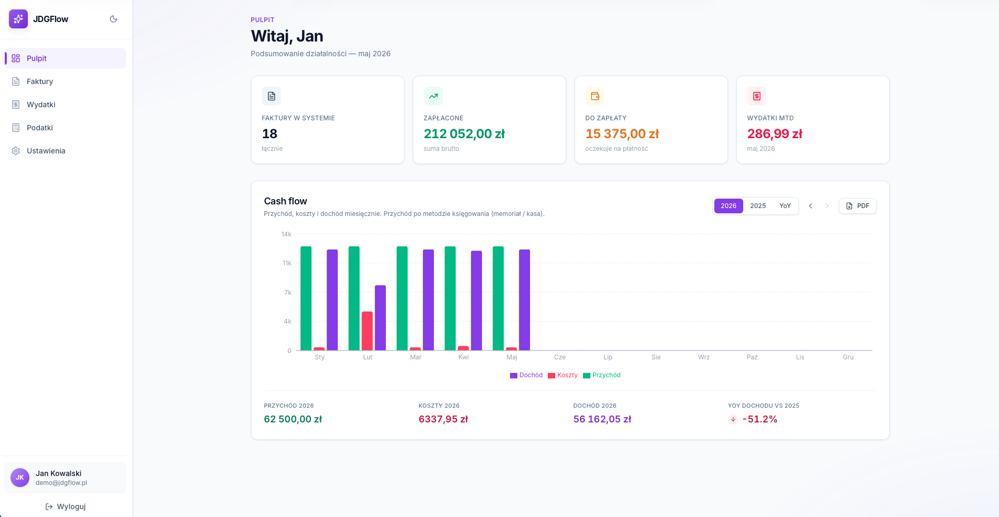
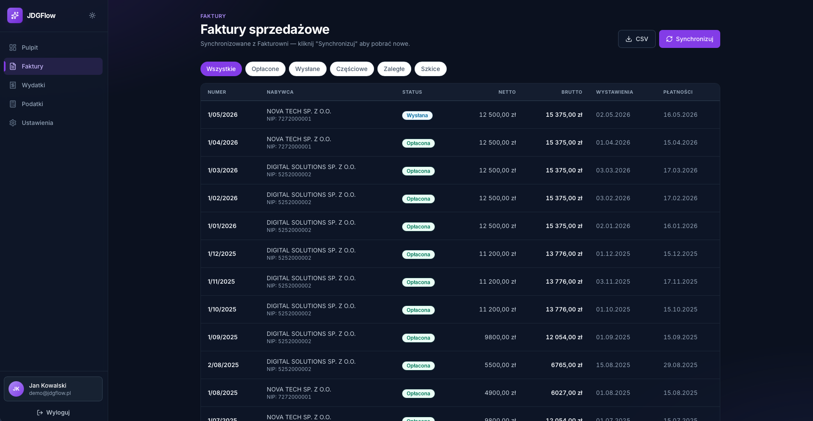
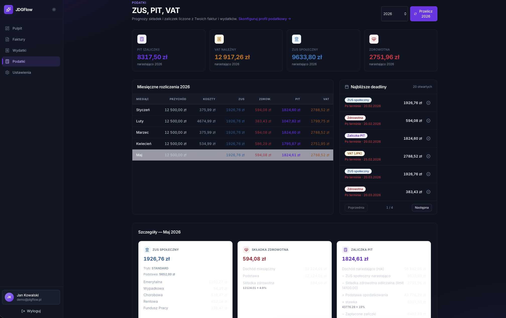
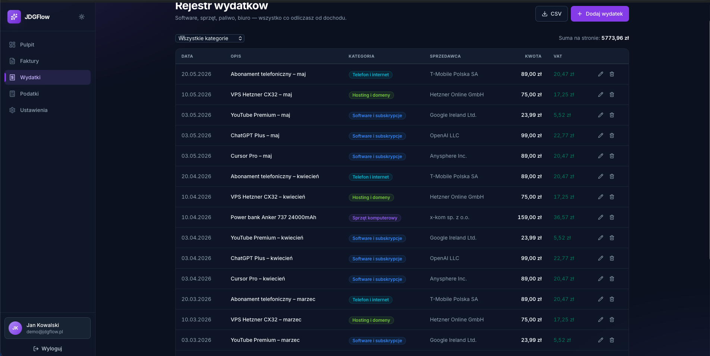
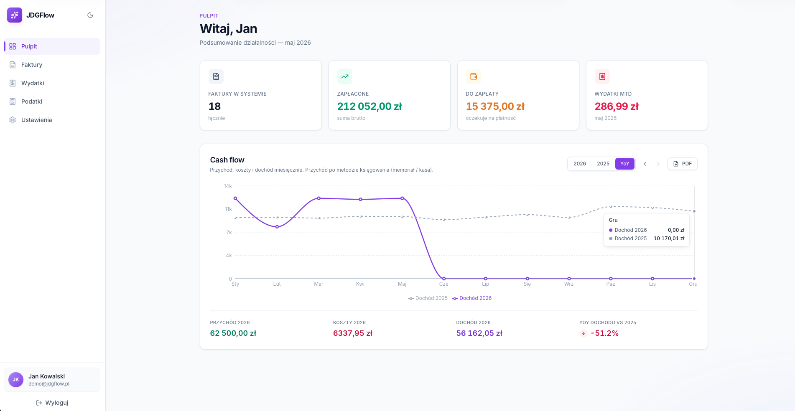
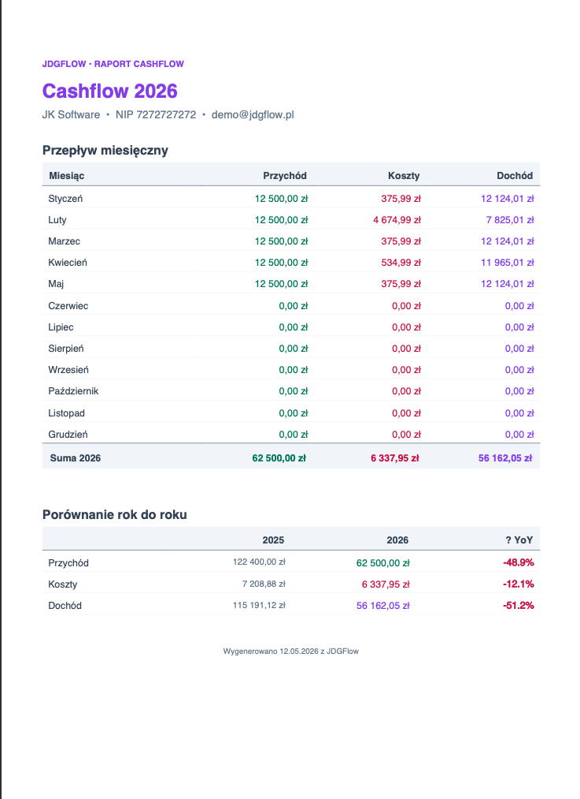
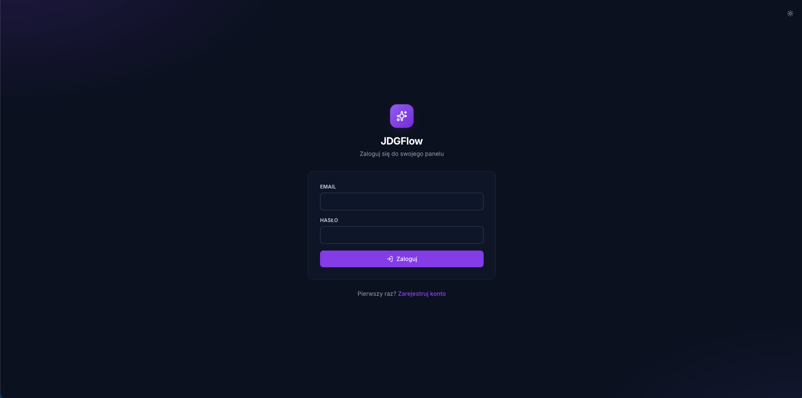

# JDGFlow

**Financial management panel for Polish sole proprietors (JDG)**



---

## Screenshots

<table>
  <tr>
    <td></td>
    <td></td>
  </tr>
  <tr>
    <td></td>
    <td></td>
  </tr>
  <tr>
    <td></td>
    <td></td>
  </tr>
</table>

---

## Features

**Invoice sync** — connects to Fakturownia and pulls your invoices with one click. After the first sync the app works
  fully offline, and syncing again never creates duplicates.

**Expense tracking** — add expenses manually or just upload a photo of a receipt. Claude Vision reads the date, amount,   
  vendor and category for you — you just confirm and save. 

**Tax engine** — calculates your monthly ZUS, health insurance, PIT advance and VAT based on real invoices and expenses.  
  Handles all ZUS modes (Ulga na start, Preferential, Mały ZUS Plus, Standard) and both tax forms (linear 19%,
  progressive scale). 

**Deadlines tracker** — shows upcoming ZUS/PIT/VAT due dates and sends an email reminder a few days before each one. No   
  duplicate reminders, even if something runs twice.

**Cash flow dashboard** — bar chart with monthly revenue, costs and income. Switch to year-over-year view to compare with 
  last year, or export everything to PDF in one click.
  
**Dark / light mode** — toggle between themes, preference is saved and applied instantly on load. 

---

## Tech Stack

| Layer | Technology |
|---|---|
| Backend | Java 21, Spring Boot 3.3, Spring Security 6 (stateless JWT) |
| Database | PostgreSQL, Flyway migrations (V1–V7), JSONB for OCR results |
| Frontend | React 19, TypeScript strict, Vite, Tailwind CSS 3.4 |
| State | TanStack Query (server), Zustand (client) |
| Forms | React Hook Form + Zod |
| Charts | Recharts |
| Storage | MinIO (S3-compatible, Docker) |
| OCR | Anthropic Claude Vision API — `tool_use` forced JSON schema |
| Email | SendGrid v3 via Spring RestClient (no SDK) |
| PDF | OpenPDF (iText fork) |

---

## Getting Started

### Prerequisites

- Java 21
- Node 20+
- PostgreSQL 16+ (`brew install postgresql@18` on macOS)
- Docker Desktop — only needed for MinIO (receipt storage); the rest of the app works without it

### 1. Database

```bash
brew services start postgresql@18
psql postgres -c "CREATE USER jdgflow WITH PASSWORD 'jdgflow';"
psql postgres -c "CREATE DATABASE jdgflow OWNER jdgflow;"
```

Flyway applies migrations V1–V7 automatically on first backend start.

### 2. Environment

```bash
cp .env.example .env
```

Fill in `.env`:

```env
# Required
FAKTUROWNIA_BASE_URL=https://your-account.fakturownia.pl
FAKTUROWNIA_API_TOKEN=your-api-token

# Optional — app works without these, returns 503 for OCR/email features
ANTHROPIC_API_KEY=sk-ant-...
SENDGRID_API_KEY=SG....
SENDGRID_FROM_EMAIL=verified@yourdomain.com
```

Find your Fakturownia token at: Settings → Account Settings → Integration → API Authorization Code.

### 3. MinIO (optional)

```bash
docker compose up -d
```

MinIO console available at http://localhost:9001 (`minioadmin` / `minioadmin`).

### 4. Backend

```bash
cd backend
./gradlew bootRun
```

API runs on http://localhost:8090.

### 5. Frontend

```bash
cd frontend
npm install
npm run dev
```

App runs on http://localhost:5173.

### First run

Log in → **Invoices → Sync** to pull invoices from Fakturownia. Then **Taxes → Recalculate** to compute ZUS/PIT/VAT from the actual data.

### Tests

```bash
cd backend
./gradlew test
```

34 unit tests (tax calculators, pure functions, no Spring context) + 26 Mockito service tests)
